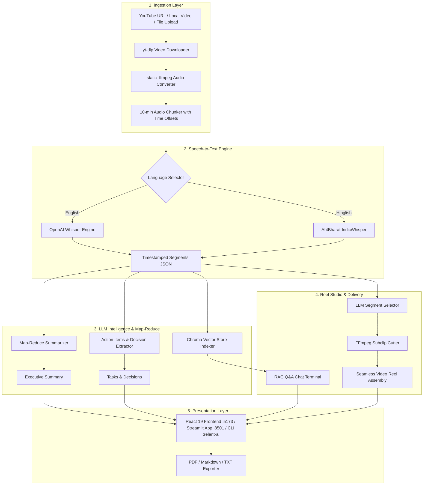

<div align="center">

# 🎬 Relent AI

### **Open-Source Neural Video Intelligence & AI Highlight Reel Studio**
*Transform YouTube videos or local recordings into executive summaries, action items, semantic RAG search, and automated highlight reels — 100% locally with Ollama, Whisper & FFmpeg.*

[](LICENSE)
[](https://python.org)
[](https://react.dev)
[](https://fastapi.tiangolo.com)
[](https://ollama.com)
[](https://github.com/openai/whisper)
[](https://ffmpeg.org)
[](CONTRIBUTING.md)

[Quickstart](#-quickstart) • [Architecture](#-architecture) • [Features](#-key-features) • [CLI Reference](docs/CLI_REFERENCE.md) • [API Reference](docs/API_REFERENCE.md) • [Documentation](docs/) • [Contributing](CONTRIBUTING.md)

</div>

---

## 🌟 Overview

**Relent AI** is an end-to-end, privacy-first AI video intelligence platform designed for developers, creators, researchers, and enterprise teams. It ingests video from YouTube URLs or local media, transcribes the speech using OpenAI Whisper or AI4Bharat IndicWhisper, summarizes and extracts structured intelligence using local Ollama LLMs, indexes the content into a Chroma vector store for semantic RAG Q&A, and automatically clips targeted video reels using FFmpeg based on plain natural language instructions.

---

## ⚡ Key Features

| Capability | Description |
| :--- | :--- |
| 📥 **Universal Ingestion** | One-click processing for **YouTube links**, local audio/video files (`.mp4`, `.mov`, `.mkv`, `.mp3`, `.wav`), or drag-and-drop web uploads. |
| 🎙️ **Multi-Engine Transcription** | Language-routed transcription powered by **Whisper Large-v3** and **AI4Bharat IndicWhisper** for Hindi / Hinglish / Indic languages. |
| 🧠 **Hierarchical Intelligence** | Reasoning and tone-matching powered by **Qwen2.5-72B (4-bit)** as primary LLM, backed by **Sarvam-M** as Hindi-specialized fallback. |
| 💬 **Interactive RAG Terminal** | Ask questions and chat directly with your video using semantic vector retrieval without hallucination. |
| 🎬 **AI Reel Studio** | Automatically cuts, trims, and concatenates exact video segments matching user prompt duration (e.g. *"2-minute product summary reel"*). |
| 📄 **Multi-Format Export** | Download intelligence reports in **PDF**, **Markdown**, or plain text formats. |
| 🎨 **Dual User Interfaces** | Modern Cyberpunk/Glassmorphic **React + Vite App** (`http://127.0.0.1:5173`) and a standalone **Streamlit Dashboard** (`http://127.0.0.1:8501`). |
| 💻 **Scriptable CLI** | Fully scriptable command-line interface (`relent-ai`) with JSON export for CI/CD and automation pipelines. |
| 🔒 **100% Local & Private** | Runs entirely on your own hardware via Ollama and local Whisper models without sending data to third-party cloud APIs. |

---

## 🏗️ Architecture



---

## 🚀 Quickstart

### Prerequisites
- **Python 3.10+**
- **Node.js 18+** & **npm** (for modern React UI)
- **Ollama**: [Download & Install Ollama](https://ollama.com)

### 1. Clone & Setup Environment
```bash
git clone https://github.com/HarshPopat23/Relent.git
cd Relent

# Create and activate Python virtual environment
python -m venv .venv
# On Windows:
.\.venv\Scripts\activate
# On macOS/Linux:
source .venv/bin/activate

# Install dependencies in editable mode
pip install -r requirements.txt
pip install -e ".[dev]"
```

### 2. Configure Local LLM & Ollama
```bash
# Pull the recommended model in Ollama
ollama pull qwen2.5:3b-instruct

# Copy the environment file template
cp .env.example .env
```

### 3. Launch Development Stack
#### On Windows:
```cmd
scripts\run_dev.bat
```
#### On Linux / macOS:
```bash
chmod +x scripts/run_dev.sh
./scripts/run_dev.sh
```

Open your browser at:
- 🌐 **Modern React App**: [http://127.0.0.1:5173](http://127.0.0.1:5173)
- 📊 **Streamlit Dashboard**: [http://127.0.0.1:8501](http://127.0.0.1:8501)
- 🔌 **API Health Check**: [http://127.0.0.1:8000/api/health](http://127.0.0.1:8000/api/health)

---

## 💻 CLI Usage

Relent AI includes a powerful command-line interface:

```bash
# Process a video and save markdown intelligence report
python main.py --source "https://youtu.be/11Y3B33oCLE" --output "report.md"

# Generate a 2-minute highlight reel directly from terminal
python main.py --source "video.mp4" --reel "2 minute product summary"

# Output structured JSON for automation scripts
python main.py --source "https://youtu.be/11Y3B33oCLE" --json

# Launch interactive Q&A terminal
python main.py
```

👉 See the complete [CLI Reference Guide](docs/CLI_REFERENCE.md) for all options and flags.

---

## 🧪 Running Automated Tests

Run the test suite locally using `pytest`:

```bash
# Run all unit tests
pytest tests/ -v

# Run with coverage report
pytest tests/ --cov=core --cov=utils

# Run standalone test runner
python run_tests.py
```

---

## 🐳 Docker Deployment

Run the complete stack inside Docker containers:

```bash
docker-compose up --build
```

---

## 📖 In-Depth Guides & Documentation

- 📘 [System Architecture & Pipeline Flow](docs/ARCHITECTURE.md)
- 🔌 [REST API Reference](docs/API_REFERENCE.md)
- 💻 [Command-Line Interface (CLI) Manual](docs/CLI_REFERENCE.md)
- ⚙️ [Hardware & Model Configuration Guide](docs/CONFIGURATION.md)
- 💡 [Real-World Use Cases & Practical Workflows](docs/USE_CASES.md)
- 🛠️ [Developer Guide & Architecture Extension](docs/DEVELOPMENT.md)
- 🔧 [Troubleshooting & Common Errors](docs/TROUBLESHOOTING.md)

---

## 🤝 Contributing

Contributions are what make the open-source community an amazing place to learn, inspire, and create. Any contributions you make are **greatly appreciated**.

Please review our [Contributing Guidelines](CONTRIBUTING.md) and [Code of Conduct](CODE_OF_CONDUCT.md) before submitting a pull request.

---

## 📄 License

Distributed under the **MIT License**. See [`LICENSE`](LICENSE) for more information.

---

<div align="center">
Built with ❤️ by the <b>Relent AI</b> Community
</div>
