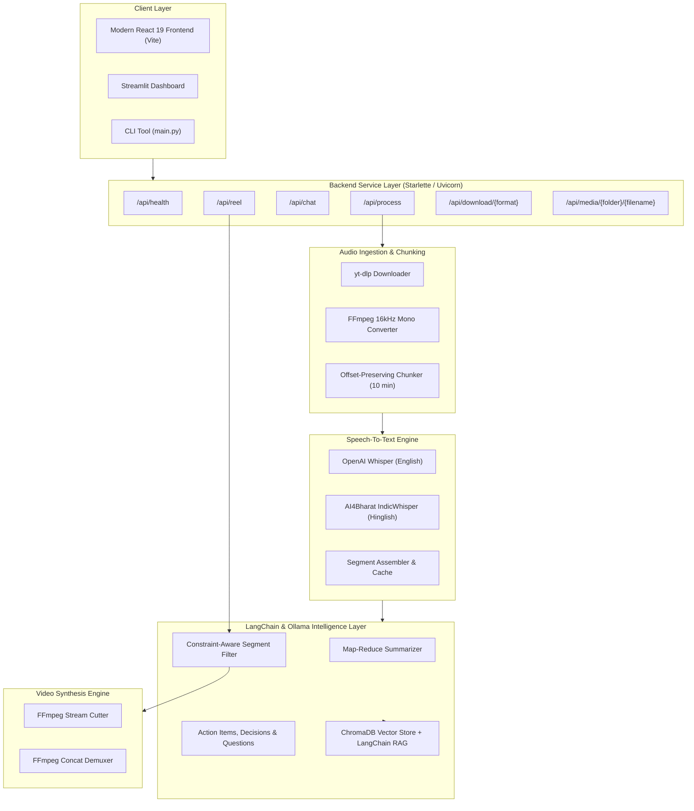

# Relent AI Architecture Deep Dive

This document provides a technical overview of **Relent AI**'s modular architecture, data flow, and underlying processing mechanisms.

---

## 1. High-Level Architecture Diagram



---

## 2. Core Subsystems

### A. Ingestion & Audio Normalization (`utils/audio_processor.py`)
1. **Source Parsing**: Automatically distinguishes between YouTube URLs and local audio/video filepaths.
2. **Download & Extraction**: Uses `yt-dlp` to download the best combined MP4 container and saves it into `downloads/`.
3. **Format Standardization**: Uses `pydub` and `static_ffmpeg` to resample the audio track to **mono 16 kHz WAV** (`_converted.wav`), which is optimal for Whisper's acoustic feature extractor.
4. **Time-Preserving Audio Chunking**: Splits large files into 10-minute blocks (`_converted.wav_chunk_i.wav`) while recording each chunk's absolute `start_offset` in seconds. This ensures long videos (hours long) do not exceed memory limits while allowing sub-second segment timestamp remapping.

---

### B. Transcription & Multi-Engine Routing (`core/transcriber.py`)
1. **Model Cache**: Loads Whisper weights into memory once (`whisper.load_model()`).
2. **Timestamp Normalization**: For each detected speech segment, converts chunk-relative timestamps into global video timestamps:
   $$\text{global\_start} = \text{chunk\_offset} + \text{segment\_start}$$
   $$\text{global\_end} = \text{chunk\_offset} + \text{segment\_end}$$
3. **Multilingual Support**:
   - `english`: Whisper model (`small`, `base`, `medium`, `large-v3`).
   - `hinglish`: Hugging Face `ai4bharat/indicwhisper` pipeline.
4. **Segment Caching**: Produces structured segment objects:
   ```json
   {
     "id": 1,
     "start": 0.0,
     "end": 14.8,
     "text": "Welcome to our product showcase...",
     "duration": 14.8
   }
   ```

---

### C. Hierarchical Map-Reduce Summarization (`core/summarizer.py`)
1. **Chunk Splitting**: Splits long transcripts using LangChain's `RecursiveCharacterTextSplitter` into manageable windows (4000 characters with 400 overlap).
2. **Map Phase**: Runs a focused prompt on each segment to extract key takeaways, discussion points, and critical milestones.
3. **Reduce Phase**: Aggregates all partial summaries into a unified executive summary with dynamic section headers tailored to the video's nature (e.g. Tutorials, Keynotes, Meetings, or Product Demos).

---

### D. Structured Information Extraction (`core/extractor.py`)
- **Action Items**: Extracts actionable tasks, assigning ownership and deadlines where available.
- **Key Decisions**: Isolates confirmed conclusions, strategic choices, and agreements.
- **Open Questions**: Flags unresolved queries, follow-ups, and open topics.

---

### E. Semantic RAG Knowledge Graph (`core/rag_engine.py` & `core/vector_store.py`)
1. **Document Ingestion**: Formats transcript segments into LangChain `Document` objects.
2. **Vector Store**: Indexes chunks into a persistent `Chroma` database with HuggingFace embeddings (`all-MiniLM-L6-v2`).
3. **Retrieval**: Uses cosine similarity retrieval ($k=4$) grounded in system prompts to prevent hallucination.

---

### F. Intelligent Reel Generation (`core/script_generator.py` & `core/video_clipper.py`)
1. **Segment Selection Prompt**: Instructs the LLM to select existing transcript segment IDs that fit the user prompt's duration (e.g., 60 seconds, 2 minutes) without generating fictitious text.
2. **Verbatim Validation**: Validates that selected segment IDs exist in the transcript and preserves chronological order.
3. **Lossless FFmpeg Trimming**: Extracts each segment losslessly using `-ss` and `-to` parameters:
   ```bash
   ffmpeg -y -ss {start} -to {end} -i {video} -c:v libx264 -c:a aac {clip_out}
   ```
4. **Concatenation**: Merges individual subclips into a final polished reel in `reels/`.

---

## 3. Directory Layout & File Organization

| Path | Purpose |
| :--- | :--- |
| `core/` | AI processing algorithms, RAG pipelines, and LLM chains |
| `utils/` | Media downloaders, format converters, and chunking |
| `frontend/` | React 19 + Vite web interface with Tailwind/CSS design system |
| `docs/` | Architectural guides, API specs, and configuration docs |
| `tests/` | Automated test suite with mock fixtures |
| `downloads/` | Working storage for source video and WAV files |
| `clips/` | Intermediate extracted video segments |
| `reels/` | Generated highlight reel videos |
| `vector_db/` | Chroma vector database files |
